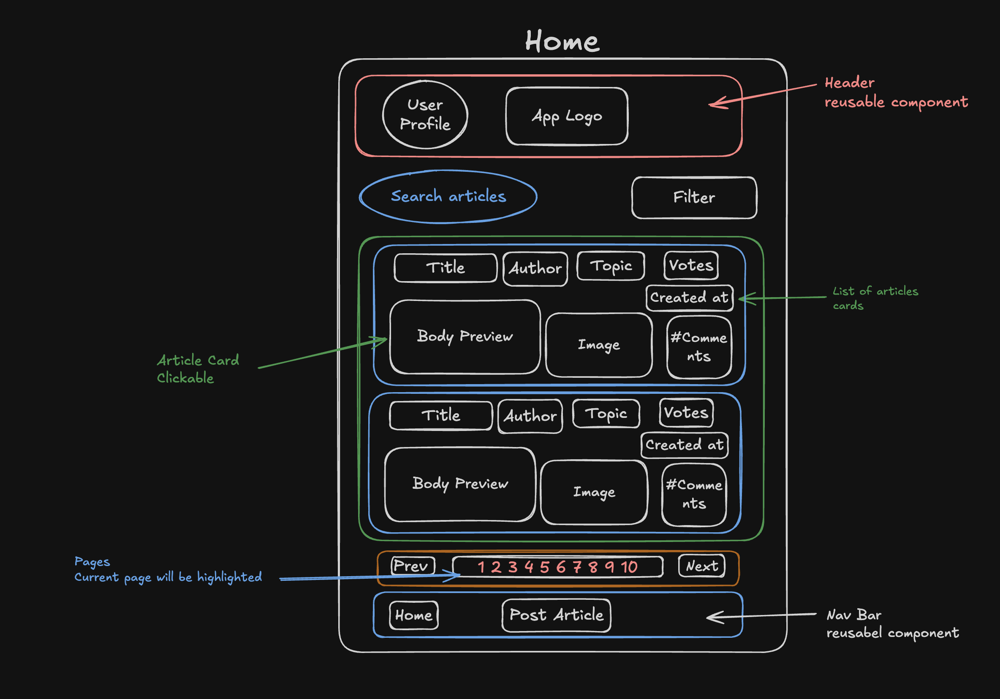
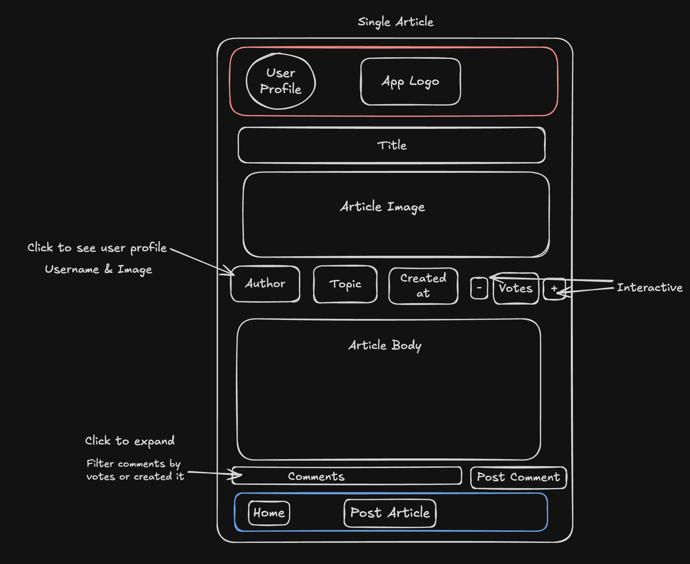
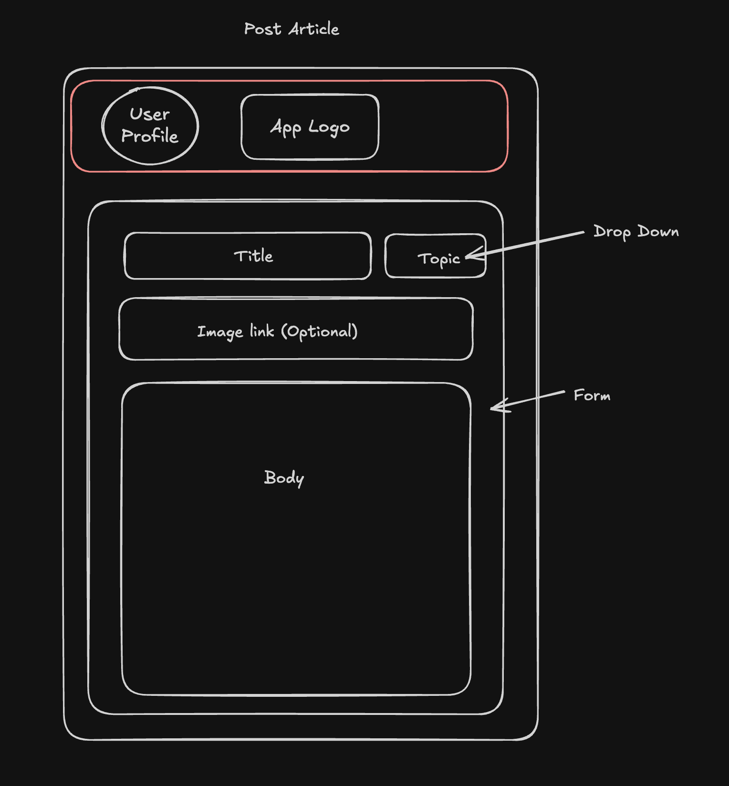
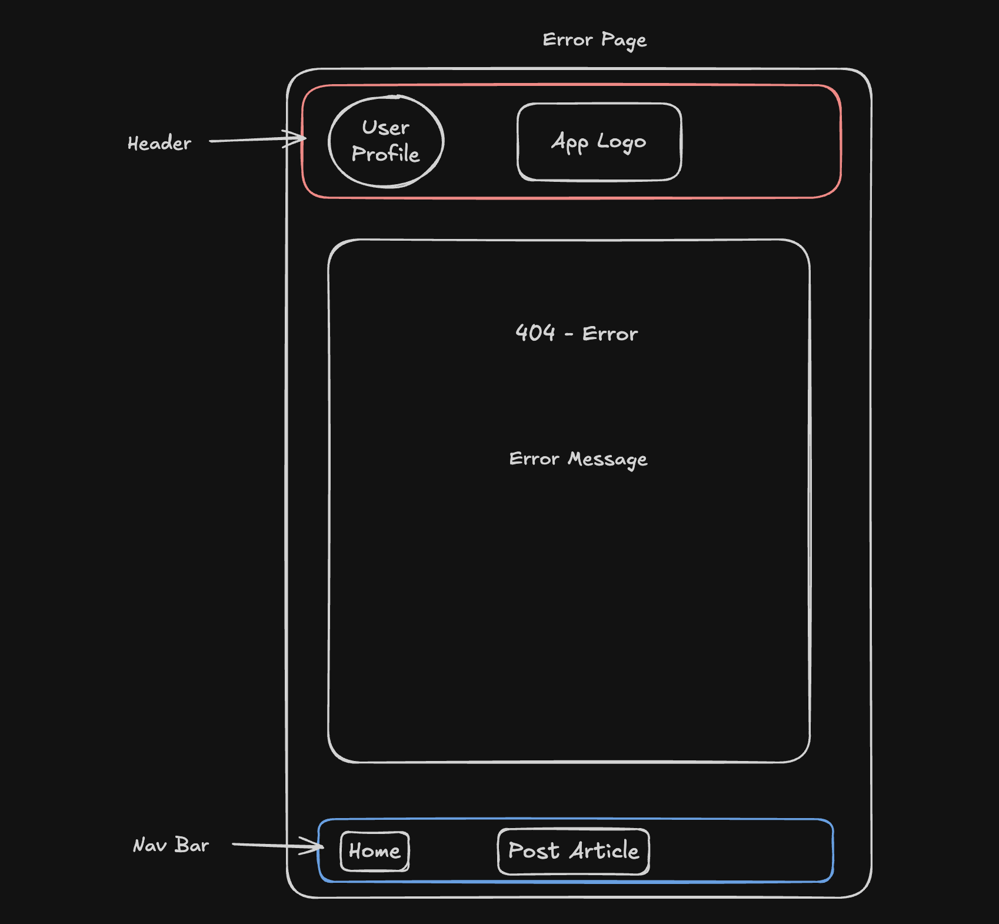
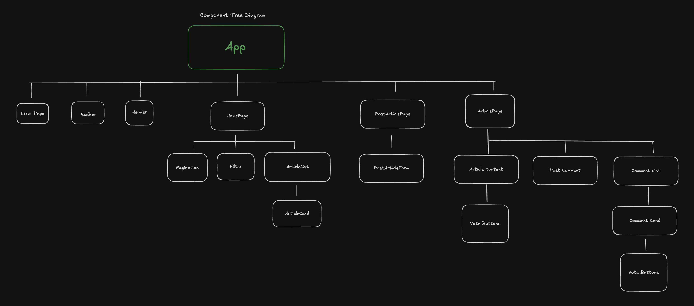

# Planning

## Wireframes

## Component Tree

## Key Decisions

- **Header** is a single reusable component rendered outside routes so it appears on every page
- **VoteButtons** is a reusable component
- **Hardcoded user** — no authentication. Logged-in user is hardcoded - will add this feature later
- **Mobile-first** — designed mainly for phone screens
- **Add comment form** lives on the Article page

## State

- App holds loggedInUser
- HomePage holds articles, topic, sortBy, order, page
- ArticlePage holds article, comments, votes
- PostArticlePage holds title, body, topic
- AddCommentForm holds body
